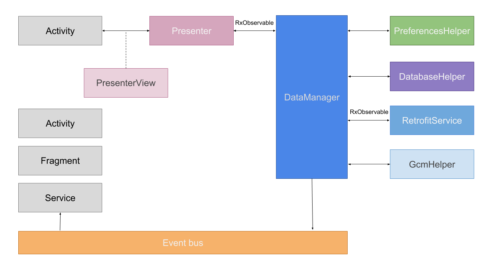

# Android sample project

## ARCHITECTURE

## STACK

### Dependency injection

- Dagger 2

### Async tasks

- [RxAndroid] (https://github.com/ReactiveX/RxAndroid)

### Networking

HTTP Client :

- [Retrofit](https://github.com/square/retrofit)

Images downloading and caching :

- [Picasso](http://square.github.io/picasso/)

JSON parsing :

- [Gson](https://code.google.com/p/google-gson/)

### Views

Injection :

- [Butterknife](http://jakewharton.github.io/butterknife/)

List and Recycler adapter :

- [EasyRecyclerAdapter](https://github.com/ribot/easy-adapter)

### Tests

Unit Tests :

- [Robolectric](http://robolectric.org/)

